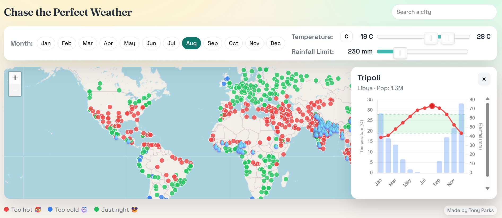

# Best Time to Travel

Web app to help pick the best time to visit a city using monthly climate normals.

## Why I Built This
I built this app because I wanted a fast, visual way to compare weather comfort across cities and plan trips around the conditions I personally enjoy most, instead of relying on scattered monthly climate tables.

## Live App
Hosted at: https://chasetheperfectweather.pages.dev/

## App Preview
Interactive world map with climate suitability markers, month filtering, and city-level climate charts.

## Responsive Experience
- Optimized for desktop browsers with a full map-first layout and side detail panel.
- Optimized for mobile browsers with touch-friendly controls, collapsible filters, and a bottom-sheet city detail view.
- Designed to retain core functionality and visual clarity across both desktop and mobile.

## Tools & Tech
- Vite (dev server + build).
- TypeScript (ES modules).
- Vanilla DOM + CSS.
- Static hosting friendly (e.g., Cloudflare Pages).

## Data Sources
- `public/data/cities.json` is the only dataset loaded at runtime.
- Climate normals (monthly temperature and rainfall) come from WorldClim v2.1, 1970-2000 (see dataset metadata).
- City coordinates and population are included in the same dataset.

## Local Development
- `npm install`
- `npm run dev`

## Tests
- `npm run test`
- The GeoNames raw source check is skipped if `data/raw/geonames/cities15000.txt` is missing.

## Production Build
- `npm run build`
- `npm run preview`
