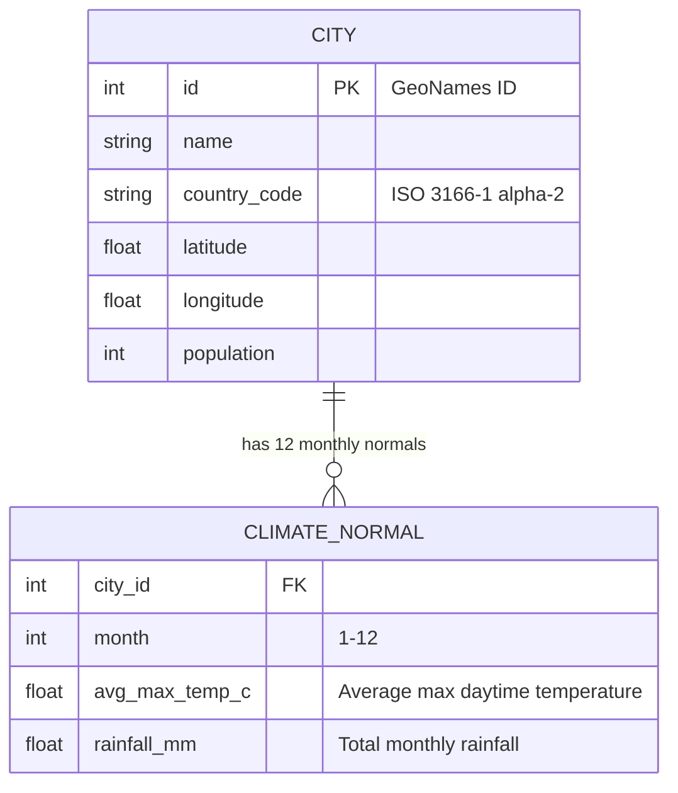

# Best Time to Travel Map

## Overview

Interactive web app that displays ~4,000 cities (100k+ population) on a world map, color-coded by temperature for a selected month. Users set a month and acceptable temperature range, then the map shows which destinations are too hot (red), too cold (blue), or just right (green). Clicking a city shows a 12-month temperature/rainfall chart. An alternative mode lets users select a city and see when the best time to visit is.

## Tech Stack

| Layer | Choice | Why | Cost |
|---|---|---|---|
| **Map** | Leaflet.js + Canvas renderer + leaflet.markercluster | 43KB gzipped, handles 4k markers at ~140ms render, 100% free, no API key | Free |
| **Tiles** | OpenStreetMap | Free, no API key, no usage limits | Free |
| **City data** | GeoNames `cities15000.zip` filtered to pop >= 100k | ~4,000-4,500 cities with lat/lng/country/population. CC-BY 4.0 | Free |
| **Climate data** | Open-Meteo Historical API (primary) + Meteostat bulk normals (supplement) | Global coverage via ERA5 reanalysis. Monthly avg max temp + rainfall | Free |
| **Charts** | Chart.js (tree-shaken, line + bar only) | ~40KB gzipped for line charts. Framework-agnostic | Free |
| **Frontend** | Vite + vanilla TypeScript | Zero-config dev server, tree-shaking, ~0KB framework overhead. TS for type safety on climate data | Free |
| **Hosting** | GitHub Pages / Netlify / Vercel | Static site, free tier | Free |

**Total bundle estimate:** ~400KB gzipped (Leaflet 43KB + Chart.js 40KB + app ~20KB + climate JSON ~300KB)

## Data Architecture

### Static JSON Dataset

One file: `data/cities.json` (~800KB raw, ~300KB gzipped)

```json
{
  "meta": { "version": "1.0", "generated": "2026-02-06", "period": "1991-2020" },
  "cities": [
    {
      "id": 1850147,
      "n": "Tokyo",
      "c": "JP",
      "lat": 35.68,
      "lng": 139.69,
      "pop": 13960000,
      "t": [9.6, 10.4, 14.2, 19.4, 23.6, 26.1, 29.9, 31.3, 27.5, 22.2, 17.1, 12.0],
      "r": [52, 56, 117, 125, 138, 168, 154, 168, 210, 198, 93, 51]
    }
  ]
}
```

- `t`: array of 12 monthly average max daytime temps (Celsius), index 0 = January
- `r`: array of 12 monthly total rainfall (mm)
- Short keys to minimize file size

### Data Pipeline (one-time build script)

```
GeoNames cities15000.zip  -->  Filter pop >= 100k  -->  ~4,000 cities with lat/lng
                                                              |
                                                              v
                                              Open-Meteo Historical API
                                              (daily temp_2m_max + precip_sum)
                                              (30-year period: 1991-2020)
                                                              |
                                                              v
                                              Compute monthly averages
                                                              |
                                                              v
                                                    cities.json (static)
```

**API budget reality:** Open-Meteo free tier = 10,000 weighted calls/day. Each city with 30 years of daily data costs ~156 weight units. That means ~64 cities/day, so ~63 days to build the full dataset.

**Practical acceleration options:**
1. Use 10-year period (2014-2023) instead of 30 years: ~26 weight/city = ~385 cities/day = ~11 days
2. Use Meteostat bulk normals (free, no rate limit) for ~60-70% of cities, Open-Meteo for gaps only
3. Pay for Open-Meteo API subscription for one month (EUR 29/month for 100k calls/day)

**Recommended approach:** Option 2 (hybrid). Meteostat bulk download for cities near weather stations, Open-Meteo for the rest. Total build time: ~3-5 days of background script running.

## MVP Feature Specification

### Core UI Layout

```
+------------------------------------------------------------------+
| Best Time to Travel                        [C/F] [About]         |
+------------------------------------------------------------------+
|  Month: [Jan] [Feb] ... [Dec]    Temp: [====18=======30====] C   |
+------------------------------------------------------------------+
|                                                                    |
|                     WORLD MAP                                      |
|              (Leaflet, drag/zoom)                                  |
|                                                                    |
|         o  o   o                                                   |
|       o    o  o  o     o = city marker                             |
|         o   o     o    (red/blue/green)                            |
|                                                                    |
+------------------------------------------------------------------+
| Legend: [green] In range  [red] Too hot  [blue] Too cold          |
+------------------------------------------------------------------+
```

When a city marker is clicked:

```
+------------------------------------------------------------------+
| Best Time to Travel                        [C/F] [About]         |
+------------------------------------------------------------------+
|  Month: [Jan] [Feb] ... [Dec]    Temp: [====18=======30====] C   |
+------------------------------------------------------------------+
|                                        |  Tokyo, Japan           |
|          WORLD MAP                     |  Pop: 13,960,000        |
|                                        |                         |
|                                        |  Avg Max Temp (C)       |
|                                        |  35|          .         |
|                                        |  30|       .. ..        |
|                                        |  25|     .       .      |
|                                        |  20|   .          .     |
|                                        |  15| .              .   |
|                                        |  10|.                .  |
|                                        |    +--J-F-M-A-M-J-J-A- |
|                                        |                         |
|                                        |  Rainfall (mm/month)    |
|                                        |  [bar chart below]      |
+------------------------------------------------------------------+
```

### Feature 1: Month + Temperature Filter

- **Month selector:** 12 buttons (Jan-Dec), one active at a time. Default: current month
- **Temperature range:** Dual-handle range slider. Default: 20-30C (sensible warm travel weather)
  - Min possible: -10C, Max possible: 45C
  - Step: 1C
  - Shows current values as labels above handles
- **Marker colors update in real-time** as user adjusts controls (debounced 200ms)
- **Color logic:**
  - Green: city's avg max temp for selected month is within the user's range
  - Red: city's avg max temp > user's max (too hot)
  - Blue: city's avg max temp < user's min (too cold)
- **Three solid colors, not a gradient** - clearest for users, best for colorblind accessibility
- **Empty state:** If no cities match, show banner: "No cities match this filter. Try widening your temperature range."

### Feature 2: City Detail Panel (Click a Marker)

- **Desktop:** Right sidebar panel (350px wide), slides in on marker click
- **Mobile:** Bottom sheet (swipe up/down to expand/dismiss)
- **Contents:**
  - City name, country, population
  - Line chart: 12-month avg max temperature (primary Y-axis, left)
  - Bar chart overlay: 12-month rainfall in mm (secondary Y-axis, right)
  - Horizontal line showing user's selected temperature range (visual reference)
  - The currently selected month is highlighted on the chart
- **Close:** X button or click elsewhere on map
- **Single chart at a time** (clicking another marker replaces the current panel)

### Feature 3: "When to Visit" Mode

- **Not a separate mode.** Clicking any marker inherently shows the yearly chart, answering "when is the best time to visit?"
- The chart already displays the full 12-month picture
- The user's temperature range is shown as a shaded band on the chart, making it immediately visible which months fall in their preferred range
- **Search bar** (top of page or in sidebar) with autocomplete to find a city by name without zooming the map

### Feature 4: Map Behavior

- **Drag and zoom:** Built-in Leaflet behavior
- **Zoom range:** Min 2 (world), Max 12 (city level)
- **Default view:** Center on user's location via Geolocation API, fallback to (20, 0) zoom 2
- **Marker clustering:** Use `leaflet.markercluster` at zoom levels 2-5 to prevent overlap
  - Cluster color = majority color of contained markers (green/red/blue)
  - Cluster shows count badge
  - At zoom 6+, show individual markers
- **Marker size:** 8px radius at zoom 2-4, 10px at 5-7, 14px at 8+
- **Canvas renderer** for all CircleMarkers (single `<canvas>` element, not 4000 DOM nodes)

### Feature 5: Temperature Unit Toggle

- **C/F toggle button** in header
- Default: Celsius (international app, most of the world uses C)
- Slider labels, chart axes, and popup values all update on toggle
- Saved to localStorage

## Implementation Phases

### Phase 0: Data Pipeline (Python script, runs independently)

**Goal:** Generate `data/cities.json` with climate data for ~4,000 cities

Tasks:
- [ ] `scripts/build_dataset.py` - Download GeoNames `cities15000.zip`, filter to pop >= 100k
- [ ] `scripts/build_dataset.py` - Download Meteostat bulk station list + normals, match cities to nearest station
- [ ] `scripts/build_dataset.py` - For cities without Meteostat coverage, fetch from Open-Meteo Historical API
- [ ] `scripts/build_dataset.py` - Compute monthly avg max temp + total rainfall per city
- [ ] `scripts/build_dataset.py` - Output `data/cities.json` in compact format
- [ ] `scripts/build_dataset.py` - Save progress incrementally (resume if interrupted)
- [ ] Validate output: no nulls, all 12 months present, temp values in sane range (-30 to 50C)

**Data quality checks:**
- Discard cities where climate data covers < 10 of 12 months
- Flag and review cities with avg max temp > 45C or < -40C
- Cross-check a sample of 20 cities against Wikipedia/climate-data.org

### Phase 1: Map + Static Markers (no filtering yet)

**Goal:** Leaflet map rendering all ~4,000 cities from JSON

Tasks:
- [ ] `index.html` - Vite project scaffold (`npm create vite@latest -- --template vanilla-ts`)
- [ ] `src/main.ts` - Initialize Leaflet map with OSM tiles, center on world view
- [ ] `src/data.ts` - Fetch and parse `data/cities.json`, type definitions for city data
- [ ] `src/map.ts` - Render all cities as `L.circleMarker` on Canvas renderer
- [ ] `src/map.ts` - Add `leaflet.markercluster` for low zoom levels
- [ ] `src/map.ts` - Basic popup on marker click showing city name + country
- [ ] Test: map loads in < 2 seconds, pan/zoom is smooth at 60fps

### Phase 2: Temperature Filtering + Color Coding

**Goal:** Month selector + temp range slider control marker colors

Tasks:
- [ ] `src/controls.ts` - Month selector (12 buttons, current month default)
- [ ] `src/controls.ts` - Dual-handle temperature range slider (noUiSlider or custom)
- [ ] `src/controls.ts` - C/F toggle button with localStorage persistence
- [ ] `src/map.ts` - `updateMarkerColors(month, minTemp, maxTemp)` function
- [ ] `src/map.ts` - Color logic: green (in range), red (too hot), blue (too cold)
- [ ] `src/map.ts` - Debounce filter updates (200ms) for smooth slider interaction
- [ ] `src/controls.ts` - Empty state banner when no cities match
- [ ] `index.html` - Persistent legend (green/red/blue explanation)
- [ ] Test: dragging slider updates ~4000 markers without frame drops

### Phase 3: City Detail Panel + Charts

**Goal:** Click a marker to see yearly temperature + rainfall chart

Tasks:
- [ ] `src/panel.ts` - Sidebar panel component (350px, slides in from right)
- [ ] `src/panel.ts` - City header: name, country, population (formatted)
- [ ] `src/chart.ts` - Chart.js line chart: 12-month avg max temp
- [ ] `src/chart.ts` - Chart.js bar chart overlay: 12-month rainfall (secondary Y-axis)
- [ ] `src/chart.ts` - Horizontal shaded band showing user's selected temp range
- [ ] `src/chart.ts` - Highlight the currently selected month on chart
- [ ] `src/chart.ts` - Tooltips on hover showing exact values
- [ ] `src/panel.ts` - Close button + click-outside-to-close
- [ ] `styles/panel.css` - Mobile responsive: bottom sheet layout below 768px
- [ ] Test: chart renders correctly for cities in all hemispheres

### Phase 4: Search + Polish

**Goal:** City search, UX polish, responsive design

Tasks:
- [ ] `src/search.ts` - Search bar with autocomplete (fuzzy match on city names)
- [ ] `src/search.ts` - Search result click: pan map to city + open detail panel
- [ ] `src/map.ts` - Geolocation API for initial map center (with permission prompt)
- [ ] `styles/` - Responsive layout for mobile (controls stack vertically, full-width map)
- [ ] `styles/` - Touch-friendly: larger markers on touch devices, tap targets >= 44px
- [ ] `src/controls.ts` - Save last filter state to localStorage, restore on return visit
- [ ] `index.html` - Loading skeleton while JSON fetches
- [ ] `index.html` - Meta tags, favicon, page title
- [ ] Test: works on Chrome, Firefox, Safari, mobile Chrome/Safari
- [ ] Deploy to GitHub Pages / Netlify

## Post-MVP Features (ordered by value)

### 1. Rainfall Filter
- Add dual-handle slider for acceptable monthly rainfall (mm)
- Data already in JSON, just needs UI + filter logic
- Gray out or use a different marker style for cities exceeding rainfall threshold

### 2. Seasonal Tourist Levels
- Data source: Would need to scrape or manually curate (peak/shoulder/low season per city)
- Not all cities will have this data - show "unknown" gracefully
- Display as an icon or label in the detail panel

### 3. Smart Traveller Danger Rating
- Source: smartraveller.gov.au (Australian government travel advisories)
- Scrape or use RSS feed for country-level risk ratings
- Display as a warning badge on markers / in detail panel
- Country-level data, not city-level

### 4. Cost of Travel Index
- Source: Numbeo, Expatistan, or similar cost-of-living databases
- Show relative daily cost estimate in detail panel
- Could color-code or size markers by cost

### 5. City Comparison Mode
- Pin multiple cities to compare side-by-side
- Overlay temperature curves on a single chart

## Key Design Decisions

| Decision | Choice | Rationale |
|---|---|---|
| 3 colors vs gradient | **3 solid colors** | Clearest for users, best colorblind accessibility |
| Separate modes vs single UI | **Single UI** (click marker = yearly chart) | Simpler, less cognitive overhead. Search bar handles "find a city" |
| Chart location | **Sidebar (desktop) / bottom sheet (mobile)** | Doesn't obscure map, allows map interaction while viewing chart |
| Framework | **Vanilla TS (no React)** | App is simple enough - a map, some controls, a chart. No component tree needed |
| Data delivery | **Static JSON bundled with app** | No backend, no API calls at runtime, instant filtering |
| Clustering | **leaflet.markercluster at zoom < 6** | Prevents overlap at world/continent view, shows individual cities when zoomed in |
| Default temp range | **20-30C** | Represents comfortable warm travel weather, good starting point |

## Risk Assessment

| Risk | Likelihood | Impact | Mitigation |
|---|---|---|---|
| Data pipeline takes weeks | High | Blocks MVP | Start pipeline immediately (Phase 0). Use 10-year avg instead of 30 if needed. Pre-build a small sample (100 cities) for dev. |
| Open-Meteo rate limits | Medium | Slows data build | Hybrid approach: Meteostat bulk + Open-Meteo for gaps. Throttle requests. |
| 4k markers laggy on mobile | Low | Poor mobile UX | Canvas renderer handles this. Reduce visible markers at low zoom via clustering. |
| Missing climate data for some cities | Medium | Incomplete dataset | Accept 90%+ coverage as good enough. Hide cities with missing data. |
| Leaflet.markercluster performance | Low | Visual jank when zooming | Canvas renderer + debounced updates. Tested to work at 10k+ markers. |

## ERD (Data Model)



(In practice, this is flattened into a single JSON object per city with `t[]` and `r[]` arrays.)

## File Structure

```
best-time-to-travel/
  index.html
  package.json
  tsconfig.json
  vite.config.ts
  data/
    cities.json            # ~300KB gzipped, static climate dataset
  scripts/
    build_dataset.py       # One-time data pipeline
    requirements.txt       # requests, numpy, pandas
    validate_data.py       # Data quality checks
  src/
    main.ts                # App entry point
    data.ts                # Fetch + parse cities.json, TypeScript types
    map.ts                 # Leaflet map init, marker rendering, color updates
    controls.ts            # Month selector, temp slider, C/F toggle
    panel.ts               # City detail sidebar/bottom sheet
    chart.ts               # Chart.js config for temp + rainfall charts
    search.ts              # City search with autocomplete
  styles/
    main.css               # Layout, controls, responsive breakpoints
    panel.css              # Sidebar + bottom sheet styles
    map.css                # Map container, legend, markers
```

## References

- [Leaflet.js](https://leafletjs.com/) - Map library
- [leaflet.markercluster](https://github.com/Leaflet/Leaflet.markercluster) - Clustering plugin
- [Chart.js](https://www.chartjs.org/) - Charting library
- [GeoNames cities15000](https://download.geonames.org/export/dump/) - City database
- [Open-Meteo Historical API](https://open-meteo.com/en/docs/historical-weather-api) - Climate data
- [Meteostat Bulk Data](https://dev.meteostat.net/bulk/) - Pre-computed climate normals
- [Vite](https://vitejs.dev/) - Build tool
- [noUiSlider](https://refreshless.com/nouislider/) - Range slider library (lightweight option)
